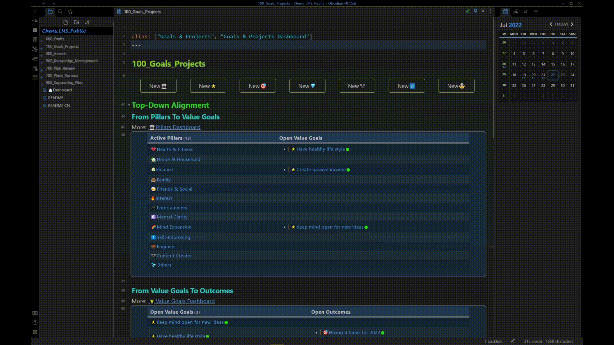
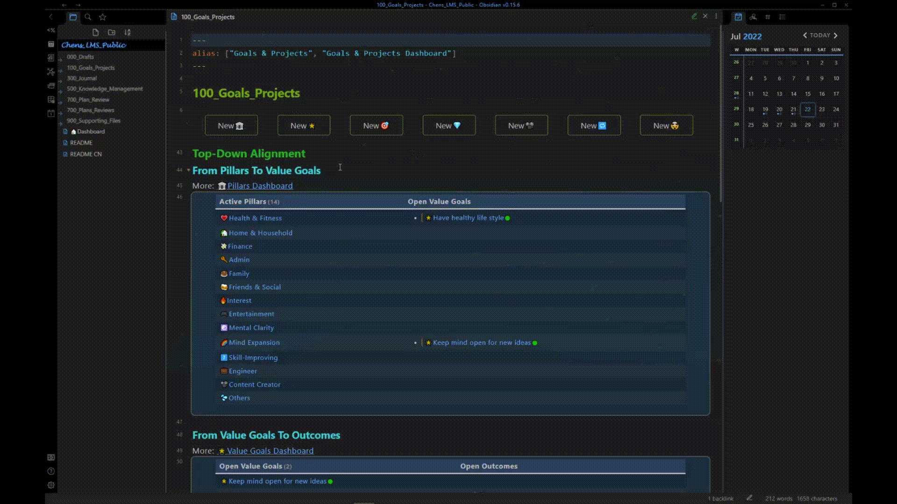

# Create Notes for Goals and Project
[Back to README](../../README.md)

## Create pillar

**Step1:** Create a new pillar page
See  [Add your first notes](QS_Add_your_first_notes.md) 
**Step 2:** Name the pillar
Emoji allowed
**Step 3:** Change the sorting index
The sorting index is used for sorting pillars in the dataview table in the dashboards.
**Step 4:** Select pillar category 
There are 4 standard categories

## Create value goal

