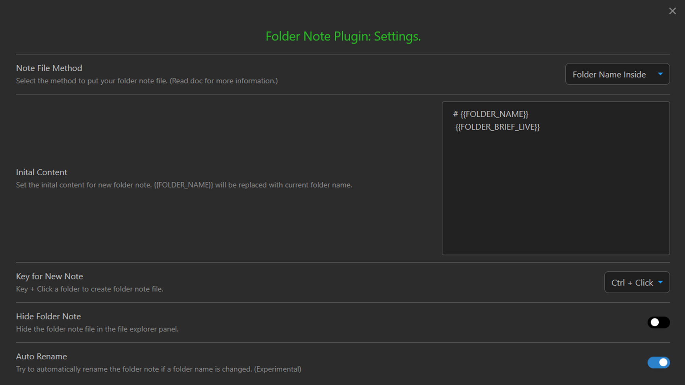

# Install mandatory plugins

[Back to README](../../README.md)

This vault uses community plugins to make certain workflows possible. Most plugins are already integrated into the vault repository. But you should install one of them manually due to missing permission. 

- [Folder note: Plugin to add description note to a folder for Obsidian. ](https://github.com/xpgo/obsidian-folder-note-plugin)

## How to install community plugins

- Open settings
- Active "Community plugins" panel
- Turn on "Restricted mode", if not yet
- Click the button "Browse" and search the plugins to install

### Settings for Buttons

Not required.

### Settings for folder note

