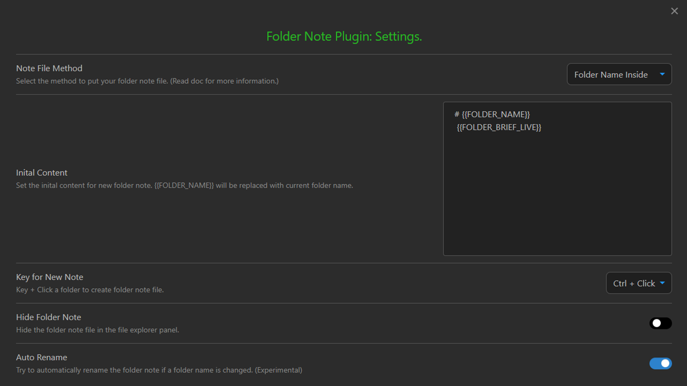

# 安装缺失插件

[返回读我](../../README_CN.md)
  
此笔记库(Vault)使用第三方插件来实现工作流程。大多数插件已经集成到笔记库中。但是由于没有得到许可，你需要手动安装其中两个插件。

- [Buttons: Buttons in Obsidian ](https://github.com/shabegom/buttons)
- [Folder note: Plugin to add description note to a folder for Obsidian. ](https://github.com/xpgo/obsidian-folder-note-plugin)

## 如何安装社区插件
- 打开设置 
- 激活的“第三方插件”面板 
- 打开“安全模式”，如果还没有打开的话
- 单击“浏览”按钮，并搜索并且安装插件

### Buttons插件的设置

无需设置。

### folder note插件的设置

##  插件 (已整合)
- [Admonition: Adds admonition block-styled content to Obsidian.md ](https://github.com/valentine195/obsidian-admonition)
- [Calendar: Simple calendar widget for Obsidian. ](https://github.com/liamcain/obsidian-calendar-plugin)
- [Completr: Auto-completion plugin for the obsidian editor. ](https://github.com/tth05/obsidian-completr)
- [Daily-notes-viewer ](https://github.com/Johnson0907/obsidian-daily-notes-viewer)
- [Dataview: A high-performance data index and query language over Markdown files, for https://obsidian.md/. ](https://github.com/blacksmithgu/obsidian-dataview)
- [Filename heading sync: Obisdian.md plugin to keep the filename and the first header of the file in sync ](https://github.com/dvcrn/obsidian-filename-heading-sync)
- [MetaEdit: MetaEdit for Obsidian ](https://github.com/chhoumann/MetaEdit)
- [Periodic-notes: Create/manage your daily, weekly, and monthly notes in Obsidian ](https://github.com/liamcain/obsidian-periodic-notes)
- [Obsidian-columns](https://github.com/tnichols217/obsidian-columns)
- [Obsidian-tasks: Task management for the Obsidian knowledge base. ](https://github.com/obsidian-tasks-group/obsidian-tasks)
- [Outliner: Work with your lists like in Workflowy or RoamResearch](https://github.com/vslinko/obsidian-outliner)
- [Supercharged links: obsidian plugin to add attributes and context menu options to internal links ](https://github.com/mdelobelle/obsidian_supercharged_links)
- [Templater: A template plugin for obsidian ](https://github.com/SilentVoid13/Templater)

