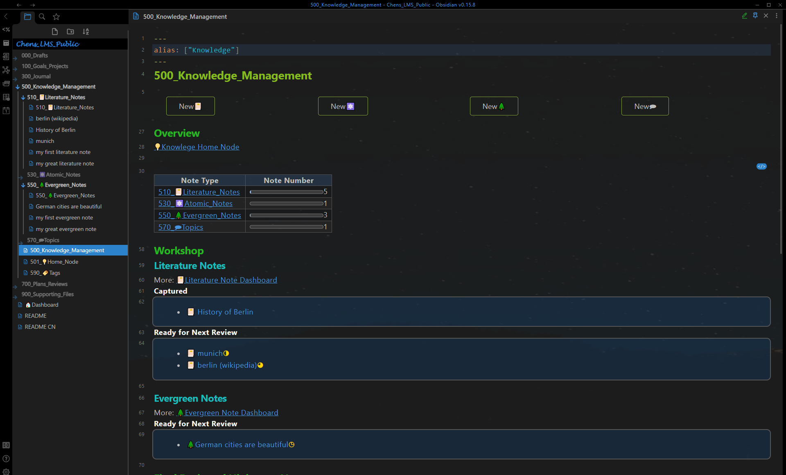
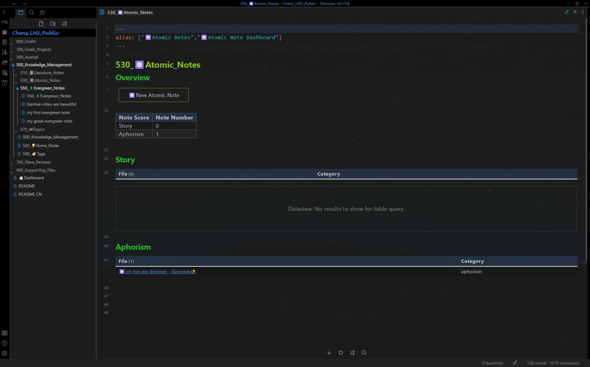
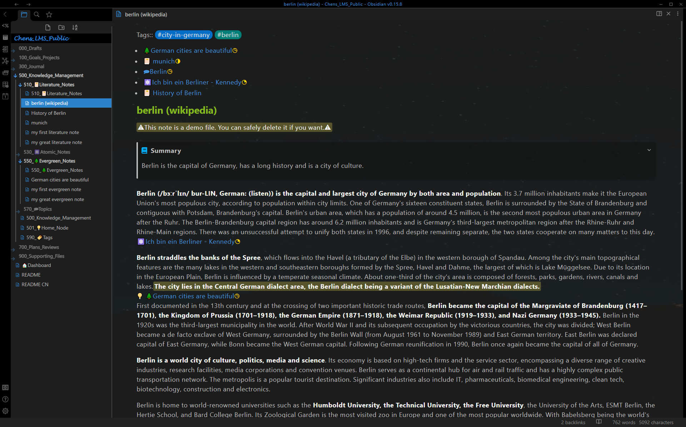
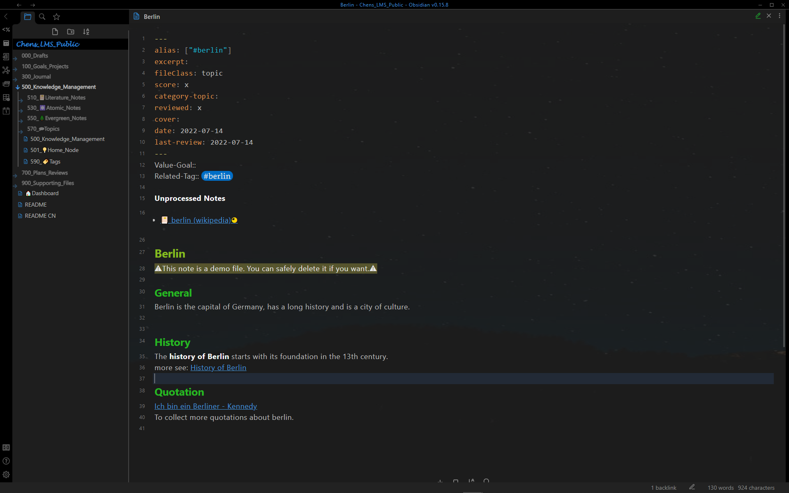

# 展示 - 知识管理
[返回读我](../../README_CN.md)

## 知识管理Dashboard

知识管理Dashboard: 使用**间隔重复**自动显示的文献笔记和常青笔记 [^1]

知识管理Dashboard: 最终回顾后的高分笔记

## 其他Dashboard

文献笔记Dashboard: 使用**间隔重复**自动显示的文献笔记 [^1]

原子笔记Dashboard

常青笔记Dashboard: 使用**间隔重复**自动显示的常青笔记 [^1]

主题笔记Dashboard

标记Dashboard

## 单笔记页面

文献笔记： 相关笔记自动重现 + 提取的原子笔记和常青笔记 + 粗体，高亮显示和总结

原子笔记

常青笔记: 相关笔记自动重现 [^2]

主题笔记: 整合助手 [^3]

[^1]: **间隔重复：** 笔记将在一定时间后自动显示在Dashboard“510_📔Literature_Notes”/“550_🌲Evergreen_Notes”和“500_Knowledge_Management”上，具体取决于**分数**、**reviewed** 和 **last-review** 在前面的问题中。

[^2]: **相关笔记自动重现：**在编辑具有相同**标签**的文献笔记、常青笔记和主题笔记时，笔记将自动重铺。

[^3]: **整合助手：** 带有**相关标签**的所有笔记都显示在**未处理**下方。笔记一旦被主题引用（使用外链），将不会在下面未处理的列表中列出。