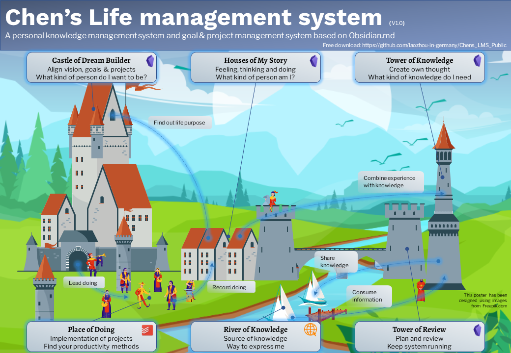

# 简介
[English](README.md) | [中文版](README_CN.md)

LMS（Life Management System）是基于Obsidian.md的个人知识管理系统和目标&项目管理系统。

## 快速开始
[5种创建笔记的方法](900_Supporting_Files/991_Readme_CN/QS_a1_5_ways_to_create_new_notes.md)  
[为目标和项目创建笔记](900_Supporting_Files/991_Readme_CN/QS_b1_Create_notes_for_goals_projects.md)  
[为日志创建笔记](900_Supporting_Files/991_Readme_CN/QS_c1_Create_notes_for_journal.md)  
[为知识管理创建笔记](900_Supporting_Files/991_Readme_CN/QS_d1_Create_notes_for_knowledge_management.md)   
[发展知识管理中的笔记](900_Supporting_Files/991_Readme_CN/QS_d2_Develop_notes_for_knowledge_management.md)  
[为计划和回顾创建笔记](900_Supporting_Files/991_Readme_CN/QS_e1_Create_notes_for_plans_reviews.md)    

## 展示
[目标和项目](900_Supporting_Files/991_Readme_CN/SC_a1_Goals_projects.md)   
[日志](900_Supporting_Files/991_Readme_CN/SC_b1_Journal.md)   
[知识管理](900_Supporting_Files/991_Readme_CN/SC_c1_Knowledge_management.md)    
[计划管理](900_Supporting_Files/991_Readme_CN/SC_d1_Plans_Reviews.md)  

## 手册 (创建中)
### 概述
[Intro](900_Supporting_Files/991_Readme_CN/01_Intro.md)  
[Folder structure](900_Supporting_Files/991_Readme_CN/02_Folder_structure.md)  
[Templates](900_Supporting_Files/991_Readme_CN/03_Templates.md)   

### 目标和项目
*Place holder*  

### 日志
*Place holder*  

### 知识管理
[Note types](900_Supporting_Files/991_Readme_CN/PKM01_Note_types.md)   Coming soon  
[Links and tags](900_Supporting_Files/991_Readme_CN/PKM02_Links_and_tags.md) Coming soon  
[Literature note](900_Supporting_Files/991_Readme_CN/PKM03_Literature_note.md) Coming soon  
[Atomic note](900_Supporting_Files/991_Readme_CN/PKM04_Atomic_note.md) Coming soon  
[Evergreen note](900_Supporting_Files/991_Readme_CN/PKM005_Evergreen_note.md) Coming soon  
[Topic](900_Supporting_Files/991_Readme_CN/PKM006_Topic.md) Coming soon  
[Put it together](900_Supporting_Files/991_Readme_CN/PKM010_Put_it_together.md) Coming soon  

### 计划和回顾
*Place holder*  

## 感谢
- [Obsidian.md](https://obsidian.md/)
- Progressive summarization from [Forte Labs](https://fortelabs.co/)
- Zettelkasten from Niklas Luhmann
- [Linking Your Thinking](https://www.linkingyourthinking.com/)
- [August Bradley - Life Design - PPV](https://www.youtube.com/user/augustbradley/featured)
- [tot0/ObsidianPPV: PPV implementation for Obsidian](https://github.com/tot0/ObsidianPPV)
- [Blue-Topaz_Obsidian-css: A blue theme for Obsidian. ](https://github.com/whyt-byte/Blue-Topaz_Obsidian-css)

### 插件 (已整合)
- [Admonition: Adds admonition block-styled content to Obsidian.md ](https://github.com/valentine195/obsidian-admonition)
- [Alx-folder-note: Add description, summary, and more info to folders with folder notes. (github.com)](https://github.com/aidenlx/alx-folder-note)
- [Buttons: Buttons in Obsidian ](https://github.com/shabegom/buttons)
- [Calendar: Simple calendar widget for Obsidian. ](https://github.com/liamcain/obsidian-calendar-plugin)
- [Completr: Auto-completion plugin for the obsidian editor. ](https://github.com/tth05/obsidian-completr)
- [Daily-notes-viewer ](https://github.com/Johnson0907/obsidian-daily-notes-viewer)
- [Dataview: A high-performance data index and query language over Markdown files, for https://obsidian.md/. ](https://github.com/blacksmithgu/obsidian-dataview)
- [Filename heading sync: Obsidian.md plugin to keep the filename and the first header of the file in sync ](https://github.com/dvcrn/obsidian-filename-heading-sync)
- [Folder-note-core: Provide core features and API for folder notes in obsidian](https://github.com/aidenlx/folder-note-core)
- [MetaEdit: MetaEdit for Obsidian ](https://github.com/chhoumann/MetaEdit)
- [Periodic-notes: Create/manage your daily, weekly, and monthly notes in Obsidian ](https://github.com/liamcain/obsidian-periodic-notes)
- [Obsidian-columns](https://github.com/tnichols217/obsidian-columns)
- [Obsidian-tasks: Task management for the Obsidian knowledge base. ](https://github.com/obsidian-tasks-group/obsidian-tasks)
- [Outliner: Work with your lists like in Workflowy or RoamResearch](https://github.com/vslinko/obsidian-outliner)
- [Supercharged links: obsidian plugin to add attributes and context menu options to internal links ](https://github.com/mdelobelle/obsidian_supercharged_links)
- [Templater: A template plugin for obsidian ](https://github.com/SilentVoid13/Templater)

### 其他推荐插件 
- [Excalidraw plugin: A plugin to edit and view Excalidraw drawings in Obsidian ](https://github.com/zsviczian/obsidian-excalidraw-plugin)
- [Tag-wrangler: Rename, merge, toggle, and search tags from the Obsidian tag pane ](https://github.com/pjeby/tag-wrangler)