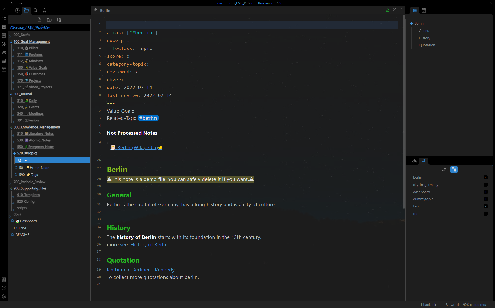

# User interface

The following figure shows the user interface of LMS.

From left to right there are 4 main elements:

1. Toolbar
2. Left Sidebar
3. Note Page
4. Right Sidebar 

## Toolbar

Standard toolbar of Obsidian.md. The tools depend on installed plugins. 

## Left Sidebar

The left sidebar has 4 panes:
- Recent file
- File explorer
- Search
- Starred
Press `Ctrl + Shit + L` to toggle it. 

## Note Page
Main areas to show the notes.
Press `F11` to switch to fullscreen mode. 

## Right Sidebar

The right sidebar has 4 panes:
- Outline
- Calender
- Backlinks
- Tag Pane
Press `Ctrl + Shit + R` to toggle it. 
