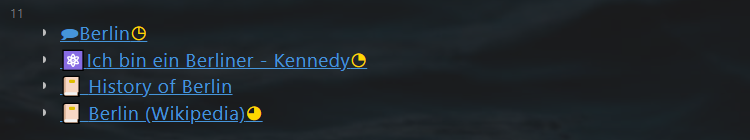
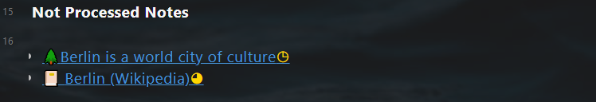

# Use Knowledge Management
With this tutorial, you'll learn to extract an evergreen note from a literature note, and consolidate it in a topic note.  
**Literature Note**: **``Berlin (Wikipedia)``**   
**Evergreen Note**:  **``Berlin is a world city of culture``**   
**Topic Note**: **``Berlin``**  

## Generate an evergreen note from the literature note

- Open the literature note **``Berlin (Wikipedia)``**   
- There are already two extract notes on lines 28 and 29. Click on line 30,  input ``💡 `` by using ``WIN + .`` or plugins
- Pressing ``CTRL + Q``, in the dialog select `Add a new note and add 🔗 in the current note (Journal & PKM)`, then select `Add 🌲Evergreen note` 
- In the next dialog, input `Berlin is a world city of culture`
- A literature note with the title `Berlin is a world city of culture` is created and opened. 
- In line 10 input the tag ``#berlin``, and all other notes with the tag ``#berlin`` are displayed automatically. 

## Consolidate the evergreen note in a topic note  

- Open the topic note **``Berlin``**, and the new evergreen note **`Berlin is a world city of culture`** is displayed below ``Not Processed Notes``.
- Create a link to  **`Berlin is a world city of culture`** anywhere suitable in the topic note. The evergreen note is no longer shown below ``Not Processed Notes``.  

- **Done**: Open the evergreen note **`Berlin is a world city of culture`** again, and check the ``link mentions`` to see, from which note it's extracted, and in which note it's linked. 
