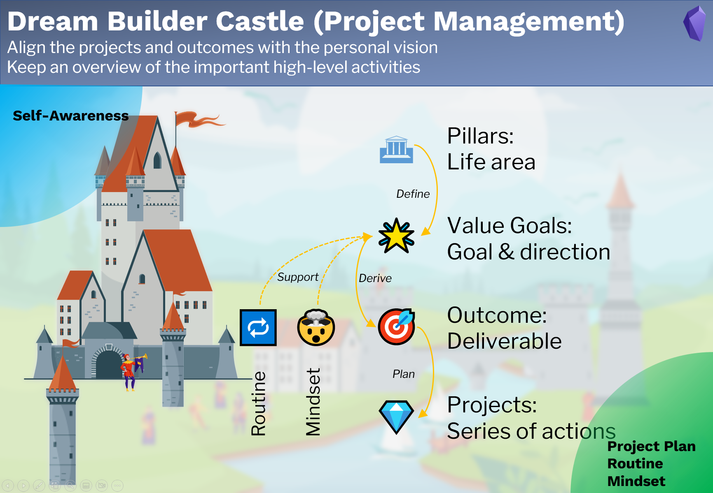
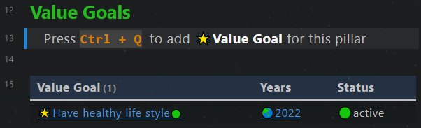
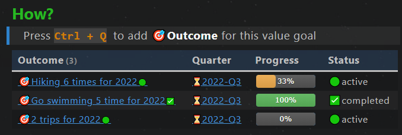
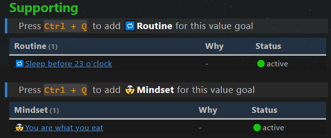

# Goal Management

## Purpose

The part **Goal Management** is designed to 

- align the projects and outcomes with the personal vision,
- keep an overview of the important high-level activities.

## Note types

This goal management uses 7 note types. 

1. **🏛Pillar**: Important life area, e.g. finance, health, family. 
2. **🌟Value goal**: Goal or vision in a life area (pillar), normally not concrete, not quantified, but a clear statement about our dreams. e.g. "I want to have a healthy lifestyle".
3. **🎯Outcome**: Quantified deliverable to achieve the value goal. They must be quantified, terminable and actionable. e.g. " Go swimming 10 times this year". Make sure, that the outcomes really serve to achieve the value goals. 
4. **💎Project**: A series of actions to achieve a milestone in the outcome.
5. **Video project**: Similar to the project, but optimized for creating videos.
6. **🔁Routine**: Repeated activities to achieve a certain value goal.
7. **🤯Mindset**: Mindsets required to achieve a certain value goal.

## Workflow



1. Define **pillars** and **value goals** based on the self-awareness
2. Derive **outcomes** from value goals as a deliverable result
3. Plan **projects** to achieve the outcomes
4. Derive required **routines** and **mindsets** to support the value goals. 

Input: Self-awareness.  
Output: Projects plan, routine and mindset.

## Pillar note

### Yalm front matter

The pillar note has the following standard property in the yalm front matter.

```yaml
---
fileClass: pillar  
sorting-index: 100
category-pillar: 🟢live  
status-set2: 🟢active 
date: 2022-04-23  
---
```

`fileClass`: Note type, always `pillar`  
`sorting-index`: used to sort pillars in the dashboard's dataview table.   
Please use the following convention to set the sorting index.  

- 🟢live:  1xx  
- 🟠love: 2xx  
- 🔵learn: 3xx  
- 🟡legacy: 4xx   

`category-pillar`: Category of the pillar, possible categories  [🟢live,🟠love,🔵learn,🟡legacy]  
`status-set2`: Status of the note, possible status [🟢active,⏸on-hold,✨future,✅archived]  
`date`: Creation date of the note, automatically created

### Section value goals

A dataview code block is used for displaying all value goals, which belong to the current pillar. 



## Value goal note

### Yalm front matter

The value goal note has the following standard property in the yalm front matter.

```yaml
---
fileClass: value-goal  
status: 🟢active
date: 2022-08-12  
---
```

`fileClass`: Note type, always `value-goal`  
`status`: Status of the note, possible status [🟢active,⏸on-hold,🔜next-up,✨future,✅completed,🗑️abandon]  
`date`: Creation date of the note, automatically created  

### Section Inline Field

`Pillar::`  Parent pillar of the current value goal  
`Years::` Years, in which the current value goal is active

### Section How

A dataview code block is used for displaying all outcomes, which belong to the current value goal. The tasks in the outcome notes are displayed as a progress bar.



### Section Supporting

Two dataview code blocks are used for displaying all routines and mindsets, which support the current value goal. 



### Section Knowledge

A dataview code block is used for displaying all topic notes (knowledge), which supports the current value goal. 


## Outcome note

### Yalm front matter

The outcome note has the following standard property in the yalm front matter.

```yaml
---
fileClass: outcome  
status: 🟢active
date: 2022-08-12  
total: 6
completed: 2
---
```

`fileClass`: Note type, always `outcome`  
`status`: Status of the note, possible status [🟢active,⏸on-hold,🔜next-up,✨future,✅completed,🗑️abandon]  
`date`: Creation date of the note, automatically created  
`total`: Total tasks in the note, automatically updated by the plugin **MetaEdit**   
`completed`: Completed tasks in the note, automatically updated by the plugin **MetaEdit**   

### Section Inline Field

`Value Goal::`  Parent value goal of the current outcome  
`Quarters::` Quarters, in which the current outcome is active 

### Section How

A dataview code block is used for displaying all projects, which belong to the current outcome. 


## Project note

### Yalm front matter

The outcome note has the following standard property in the yalm front matter.

```yaml
---
fileClass: project  
status: 🟢active
date: 2022-08-12  
total: 1
completed: 0
---
```

`fileClass`: Note type, always `project`  
`status`: Status of the note, possible status [🟢active,⏸on-hold,🔜next-up,✨future,✅completed,🗑️abandon]  
`date`: Creation date of the note, automatically created  
`total`: Total tasks in the note, automatically updated by the plugin **MetaEdit**   
`completed`: Completed tasks in the note, automatically updated by the plugin **MetaEdit**   

### Section Inline Field

`Outcome::`  Parent outcome of the current project  
`Months::` Months, in which the current project is active  


## Video project note

Similar to a project note. 

## Routine note

Similar to the outcome note.

## Mindset note

Similar to the outcome note.


