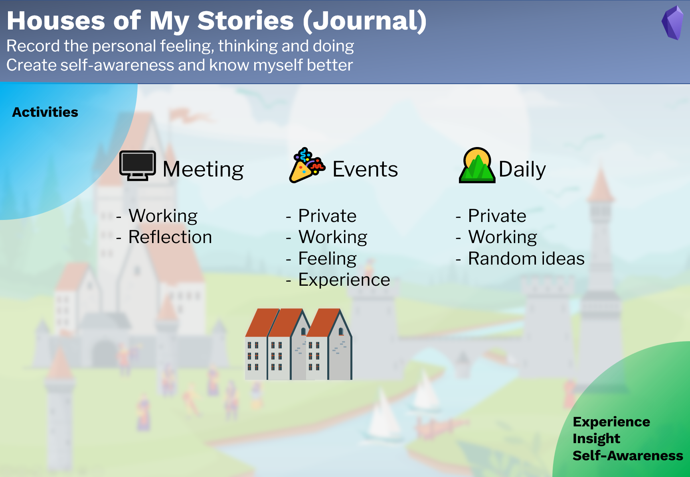

# Use Journal

## Purpose

The part **Journal** is designed to 

- record the personal feeling, thinking and doing,
- create self-awareness and know myself better.

## Note types

There are 3 note types for journals:

1. **🌄Daily note**: daily routine and random daily notes.  
2. **🎉Event note**: important event, for both private and working events. e.g. Parties, trips and conferences.   
3. **🖥Meeting note**: meeting minutes 

## Workflow

Journaling is one of the ways to know ourselves. Make journaling to record our daily activities, review them, and reflect on them. This is going to increase self-awareness, and support us to find our dream and life goals. 

Input: Daily activities.  
Output: Experience, insight and self-awareness. 

