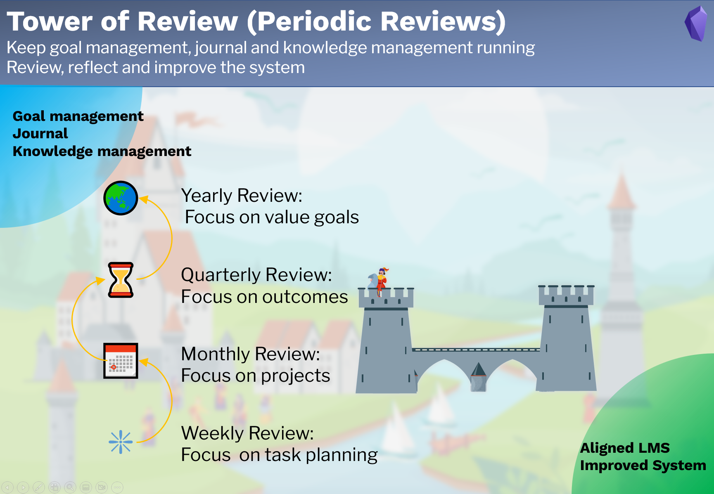

# Periodic Review

## Purpose

The part **Periodic Review** is designed to 

- keep **Goal management**, **Journal** and **Knowledge Management** running,
- review, reflect and improve the system.

## Note types

There are 4 note types for periodic review.

1. Weekly review note: for weekly review and plan, focus on the implementation of actions
2. Monthly review note: for monthly review and plan, focus on the projects
3. Quarterly review note: for quarterly review and plan, focus on the outcomes
4. Yearly review note: for yearly review and plan, focus on the value goals

## Workflow

The periodic repeated tasks for defined in the periodic review notes:

- Clean up
- Review and reflect on the daily notes and journal
- Review and reflect on goal management
- Review and reflect on knowledge management
- Review and reflect on the LMS itself.

Input: Goal management, journal and knowledge management.  
Output: Aligned Goal management, journal and knowledge management, and improved system.  

