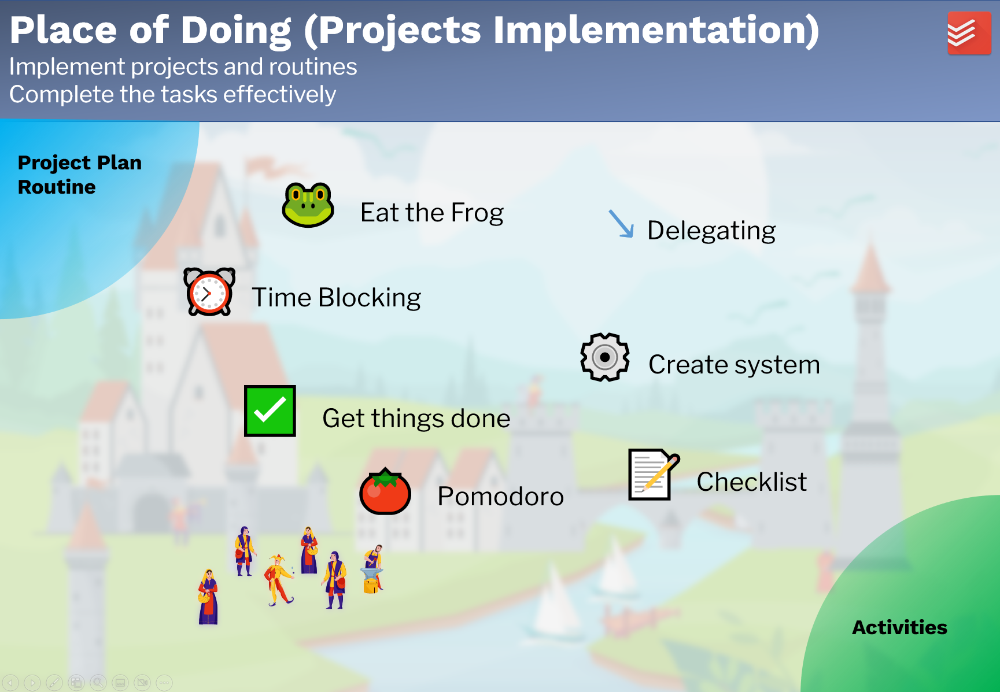

# Project Implementation

## Purpose

The part **Project Implementation** is designed to 

- implement projects and routines,
- complete the tasks effectively.

## Workflow

After the project plan is done, the next step is the project implementation. It's not easy to keep our commitment to ourselves. Sometimes we don't have sufficient time, Sometimes we don't have the willpower to do some boring tasks. Sometimes we just lost our priority due to a large number of tasks. Find the right productivity method for yourself and finish the tasks effectively. 

There are a lot of productivity methods. If a productivity method works for someone, depends on a lot of factors: the personal character, the tasks, and the implementation of the method. Everyone should find the productivity methods, which work for him. Here are the popular methods:

1. Eat the frog
2. Time blocking
3. Get things done
4. Pomodoro
5. Delegating
6. Create a system
7. Checklist

The project implementation is although part of the life management system. It is not implemented in Obsidian. Other special tools may support it better, e.g. Todoist. The usage of the tools and methods are not described here. 

Input: Project plan and desired routines.  
Output: Done tasks and established routines (activities).