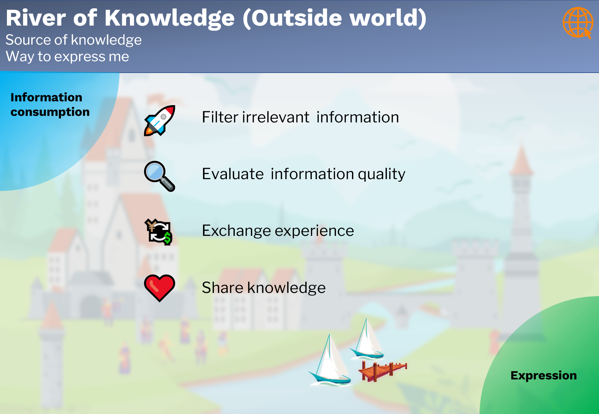

# Outside World

## Purpose

The part **Outside world** is

- the source of knowledge 
- the ways to express myself. 

## Workflow

Information from the outside world is an important source of knowledge. Nowadays obtaining information is easier than in each time in history.  But this doesn't means, that it's easier to get relevant and true information. It's an important skill to consume the information in a correct way, including filtering the irrelevant information and evaluating information quality...... 

On the other hand, it's not one way street between the outside world and me. Technology now provides everyone an easy way to express themselves to the outside world. Use this opportunity to exchange experience and to share knowledge. 

Important activities:

- Filter irrelevant information,
- Evaluate information quality,
- Exchange experience with the community, 
- Share the knowledge with the outside world.

