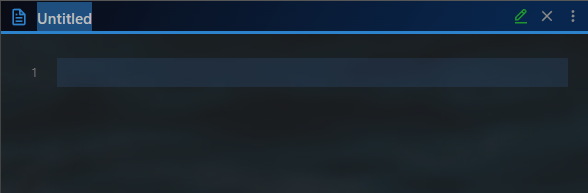
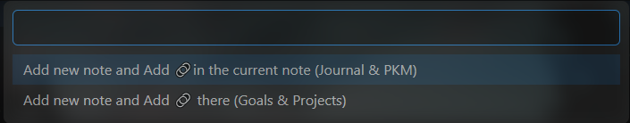
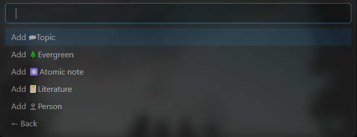
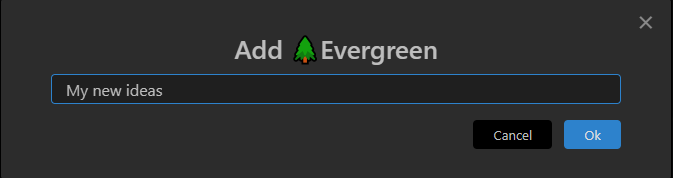
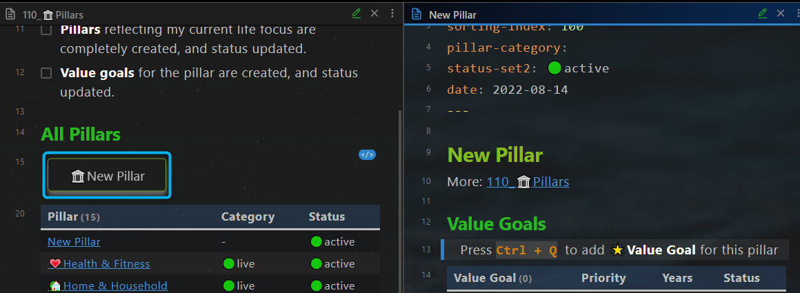

# 6 ways to create new notes

Depending on the note type, there are several ways to add new notes:

1. Use shortcut `Ctrl + N` or ``New Note`` Button
2. Use shortcut `Alt + N` [^1]
3. Use shortcut `Ctrl + Q` [^1] [^4]
4. Use buttons on the dashboards or on the notes [^1] [^2] [^3]
5. Right-click the note folder [^1]
6. Click on the day or week on the Calendar pane [^3]

[^1]: Plugin Templater required
[^2]: Plugin Buttons required
[^3]:  Plugin Calendar required

[^4]: Plugin QuickAdd required

## Use shortcut `Ctrl + N` or ``New Note`` Button

*Use case: Add a fleeting note quickly, and define the note type later.*

- Create an empty note by pressing the shortcut `Ctrl + N` or the ``New Note`` button on the **File explorer** panel  
  
- Change the file name, start the writing
- later: Insert the template by pressing the shortcut `Alt + T` 
- later: Move the note to the corresponding folder of the note type (e.g. "110_🏛Pillars" for pillar note)

## Use shortcut `Alt + N` 

*Use case: Add a note for a certain note type quickly.*

- Create a new note from a template by pressing the shortcut `Alt + N`   
  
- Change the file name
- Later: Move the note to the corresponding folder according to the note type

## Use shortcut `Ctrl + Q`

*Use case: Add a note for a certain note type quickly, and insert the link at the same time*

- press the shortcut `Ctrl + Q` and select the note type  
  
  
- Input the note title  
  
  

## Use buttons on the dashboards

*Use case: Add a note for a certain  note type, without moving the note later*

- Open a dashboard note (e.g. Goal Management Dashboard)
- Click on the button on it
- A new note is created in the correct folder
- Change the file name  

## Right-click the note folder

*Use case: Add a note for a certain note type, without moving the note later*

- Expand the left sidebar and active the **File explorer** panel, if not yet
- Navigate to the note folder  
- Right-click the note folder and create a **new note** using the context menu
- Change the file name  

## Click on the day or week on the Calendar pane

- Expand the right sidebar and active the **calendar** panel, if not yet
- Click on the day or on the week to create a new note  

