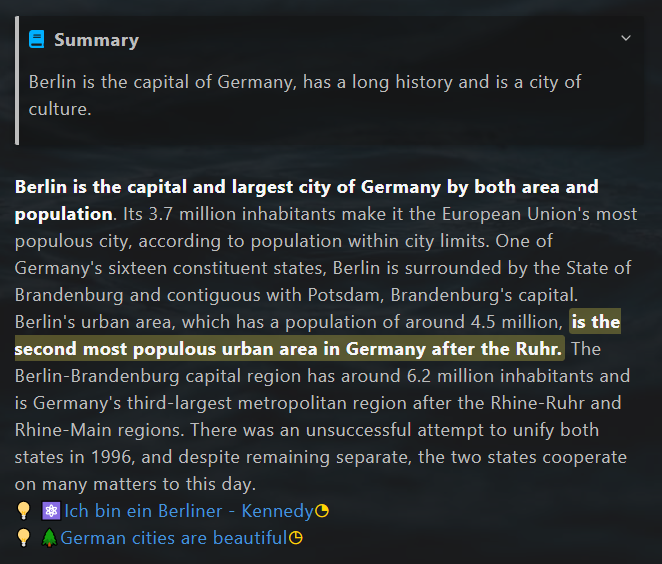
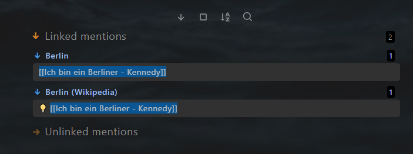

# Knowledge Management


## Note types

4 note types are used for personal knowledge management:

- 📔Literature Note
- ⚛️Atomic Note
- 🌲Evergreen Note
- 🗩Topic

**The literature note** includes all notes from the outside world. E.g., books, articles, tweets, and videos. It is normally a mixture of information pieces. E.g., facts, opinions, stories, and so on. These information pieces together create a medium, which I custom. 

**The atomic note** is the note from the external but only includes a single knowledge point. E.g., a story, an aphorism. They are the extracted highlights from the literature note and can be cited later in my articles. 

**The evergreen note** is the note for my insight. its maturity level grows with my new knowledge and experience. It is a single information piece within one topic. 

**The topic** is a collection of literature notes, atomic notes, and evergreen notes, which handle the same issue. The maturity level of the topics grows as the number of his child notes increases. 


## Workflow

### Literature note

- Create literature notes by recording outside world information 

- Distill literature notes

### Atomic note

- Extract atomic notes from the literature note

- Link atomic notes to evergreen notes

### Evergreen note

- Generate evergreen notes from the literature note, own experience and insight 

- Garden evergreen notes

### Topic note

- Create topic notes

- Consolidate topics from literature notes, atomic notes, evergreen notes and sub-topic notes. 
- Connect topic notes to the home node

The result from the knowledge management is wisdom. 


## Literature note

### Note file structure

A literature note consists of 4 parts:

- Yalm front matter
- "Context-aware resurfacing"  section 
- Note title
- Body text

#### Yalm front matter 

The literature note has the following standard property in the yalm front matter. 

~~~yaml
---
author: Wikipedia 
excerpt: Berlin is the captical of Germany
fileClass: literature-note  
score: xxxx 
category-literature-note: article  
reviewed: xx  
cover: https://dummy.org/dummy.jpg 
date: 2022-01-13  
last-review: 2022-01-13  
---
~~~

`author`: Author of the literature, optional  

`excerpt`: Excerpt of the note, optional

`fileClass`: Note type, always `literature-note` 

`score`: The score of the note, possible value: x,...,xxxxx, required for the feature **Spaced repetition**

`category-literature-note`: Category of the literature note, optional

`reviewed`: Review times, possible value: x,...,xxxxx, required for the feature **Spaced repetition**

`cover`: HTTP of an image as a cover, optional, can be used to display the cover of the literature using dataview.

`date`: Creation date of the note, automatically created 

`last-review`: Date of the last review, required for the feature **Spaced repetition**


#### "Context-aware resurfacing"  section 
After the yalm front matter, there is a section for "Context-aware resurfacing". 
```javascript
Tags:: #berlin
~~~dataviewjs
let tags = this.current().file.etags
let notes = tags
	.map(t => dv.pages(t + ' and !"' + this.current().file.path + '"'));
dv.list(notes.file.link);
~~~
```
It has two parts.

Part 1: `Tags::`, for defining the context with tag 

You can also tag in other note lines.  This line is only a suggestion to keep notes having a similar structure

Part 2: dataview code block, for resurfacing related notes.

All the notes with the same tags as the current note will be shown here, except the note itself. 

#### Note title

The note title and the note file name are kept in sync with the plugin [Filename heading sync](https://github.com/dvcrn/obsidian-filename-heading-sync).

#### Body text

The body text of the literature note. 

Example:

```markdown
~~~ad-summary
Berlin is the capital of Germany, has a long history and is a city of culture. 
~~~

**Berlin is the capital and largest city of Germany by both area and population**. Its 3.7 million inhabitants make it the European Union's most populous city, according to population within city limits. One of Germany's sixteen constituent states, Berlin is surrounded by the State of Brandenburg and contiguous with Potsdam, Brandenburg's capital. Berlin's urban area, which has a population of around 4.5 million, ==**is the second most populous urban area in Germany after the Ruhr.**== The Berlin-Brandenburg capital region has around 6.2 million inhabitants and is Germany's third-largest metropolitan region after the Rhine-Ruhr and Rhine-Main regions. There was an unsuccessful attempt to unify both states in 1996, and despite remaining separate, the two states cooperate on many matters to this day.
💡 [[Ich bin ein Berliner - Kennedy]]
💡 [[German cities are beautiful]]
```

The text is displayed in the reading mode like the picture below.



##### Progressive summarization

It's suggested to use progressive summarization by Tiago Forte to read the literature note. It's a technology to consume the information step by step, and at the meanwhile compressing it by need. This technology contains the following steps.

1.  Note
2.  Bold passage using "** **"
3.  Highlight passage using "== =="
4.  Mini-summary using admonition "~~~ad-summary"
5.  Remix

In the sample text above there are two bold passages, one highlight passage, and a mini summary.  For proper display of the mini-summary, the plugin  [Admonition](https://github.com/valentine195/obsidian-admonition) is required. 

##### Extraction of atomic notes and evergreen notes

You are expected to extract information from the literature note during the progressive summarization.:  atomic notes and evergreen notes, which resonate with you.  In the sample text, an atomic note and an evergreen note are extracted. (The last two lines.) 

The symbol  `💡` before the note tile is used to mark the extracted note. While reading the extracted note, you can easily find out, from which literature note it's extracted.  The literature note has a symbol  `💡` before the title in the linked mention section. E.g. The atomic note "Ich bin ein Berliner - Kennedy" is extracted from "Berlin (Wikipedia)", but not from the topic note "Berlin".


## Atomic note

### Note file structure

Anthe  Atomic note consists of 4 parts:

- Yalm front matter
- "Context-aware resurfacing"  section 
- Note title
- Body text

#### Yalm front matter 

The atomic note has the following standard property in the yalm front matter. 

~~~yaml
---
author: Kennedy 
excerpt: a speech by United States President John F. Kennedy 
fileClass: atomic-note  
score: xx 
category-atomic-note: aphorism  
reviewed: x 
date: 2022-07-14  
last-review: 2022-07-14  
---
~~~

`author`: Author of the literature, optional  

`excerpt`: Excerpt of the note, optional

`fileClass`: Note type, always `atomic-note` 

`score`: The score of the note, possible value: x,...,xxxxx, required for the feature **Spaced repetition**

`category-atomic-note`: Category of the atomic note, optional

`reviewed`: Review times, possible value: x,...,xxxxx, required for the feature **Spaced repetition**

`date`: Creation date of the note, automatically created 

`last-review`: Date of the last review, required for the feature **Spaced repetition**


#### "Context-aware resurfacing"  section 

After the yalm front matter, there is a section for "Context-aware resurfacing". 

```javascript
Tags:: #berlin

```

It has one part.

Part 1: `Tags::`, for defining the context with tag 

You can also tag in other note lines.  This line is only a suggestion to keep notes having a similar structure

In the atomic note, resurfacing other notes is not intended. So there is no similar dataview code block like the literature note. 

#### Note title

The note title and the note file name are kept in sync with the plugin [Filename heading sync](https://github.com/dvcrn/obsidian-filename-heading-sync).

#### Body text

Example:

```markdown
"Ich bin ein Berliner" ("I am a Berliner") is a speech by United States President John F. Kennedy given on June 26, 1963, in West Berlin. - [Ich bin ein Berliner - Wikipedia](https://en.wikipedia.org/wiki/Ich_bin_ein_Berliner)

```


##### Backlinks

The atomic notes are expected to be quoted by the other notes. You can find all notes, which quote the current atomic note in the section linked mentions. 




## Evergreen note


### Note file structure

An evergreen note consists of 4 parts:

- Yalm front matter
- "Context-aware resurfacing"  section 
- Note title
- Body text

#### Yalm front matter 

The evergreen note has the following standard property in the yalm front matter. 

~~~yaml
---
excerpt: German cities are beautiful  
fileClass: evergreen-note
score: x  
category-evergreen-note:  
reviewed: x  
date: 2022-01-14  
last-review: 2022-01-14   
---
~~~

`excerpt`: Excerpt of the note, optional

`fileClass`: Note type, always `evergreen-note` 

`score`: The score of the note, possible value: x,...,xxxxx, required for the feature **Spaced repetition**

`category-evergreen-note`: Category of the evergreen note, optional

`reviewed`: Review times, possible value: x,...,xxxxx, required for the feature **Spaced repetition**

`date`: Creation date of the note, automatically created 

`last-review`: Date of the last review, required for the feature **Spaced repetition**


#### "Context-aware resurfacing"  section 

After the yalm front matter, there is a section for "Context-aware resurfacing". 

```javascript
Tags:: #berlin
~~~dataviewjs
let tags = this.current().file.etags
let notes = tags
	.map(t => dv.pages(t + ' and !"' + this.current().file.path + '"'));
dv.list(notes.file.link);
~~~
```

It has two parts.

Part 1: `Tags::`, for defining the context with tag 

You can also tag in other note lines.  This line is only a suggestion to keep notes having a similar structure

Part 2: dataview code block, for resurfacing related notes.

All the notes with the same tags as the current note will be shown here, except the note itself. 

#### Note title

The note title and the note file name are kept in sync with the plugin [Filename heading sync](https://github.com/dvcrn/obsidian-filename-heading-sync).

#### Body text

The body text of the evergreen note. 

Example:

```markdown
I visited a lot of the cities in German. They are beautiful.
```


## Topic 

### Note file structure

A topic note consists of 4 parts:

- Yalm front matter
- "Consolidation helper"  section 
- Note title
- Body text

#### Yalm front matter 

The topic note has the following standard property in the yalm front matter. 

~~~yaml
---
alias: ["#berlin"]
excerpt:  
fileClass: topic  
score: x  
category-topic:   
reviewed: x  
cover: 
date: 2022-07-14  
last-review: 2022-07-14  
---
~~~

`alias`: Alias of the note, optional

`excerpt`: Excerpt of the note, optional

`fileClass`: Note type, always `topic` 

`score`: The score of the note, possible value: x,...,xxxxx, required for the feature **Spaced repetition**

`category-topic`: Category of the topic note, optional

`reviewed`: Review times, possible value: x,...,xxxxx, required for the feature **Spaced repetition**

`date`: Creation date of the note, automatically created 

`last-review`: Date of the last review, required for the feature **Spaced repetition**


#### "Consolidation helper"  section 

After the yalm front matter, there is a section for "Consolidation helper". 

```javascript
Value-Goal::  
Related-Tag:: #berlin 

**Not Processed Notes**
~~~dataviewjs
let currentPage = this.current()
let tagRel = currentPage["Related-Tag"]
let notes = dv.pages(tagRel 
			+ ' and !"' + this.current().file.path + '"' )
			.where(p => !p.file.inlinks.includes(currentPage.file.link) & p.file.etags.includes(tagRel));
if (tagRel != "#dummytopic") {
	dv.list(notes.file.link);
}
~~~
```

It has three parts.

Part 1: `Value-Goal::`, For which value serves this topic, purpose of studying this topic

Part 2: `Tags::`, for defining the context to be consolidated in this topic

Part 3: dataview code block to support the consolidation.

All notes with the **related tag** are listed below **Not Processed **. The notes will disappear, as soon as they are referenced within the topic (using a wiki link).

Before consolidation: Three notes are Not Processed .


After consolidation: One note remains Not Processed .


#### Note title

The note title and the note file name are kept in sync with the plugin [Filename heading sync](https://github.com/dvcrn/obsidian-filename-heading-sync).

#### Body text

Use the wiki link to reference the related notes.


