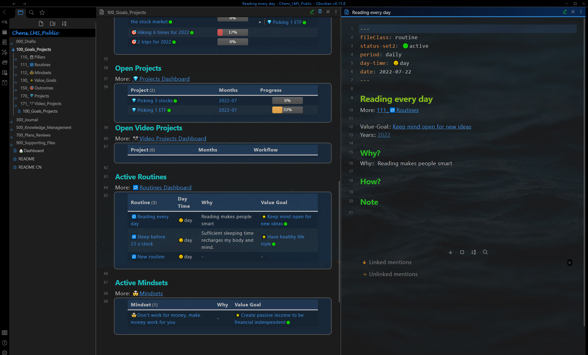
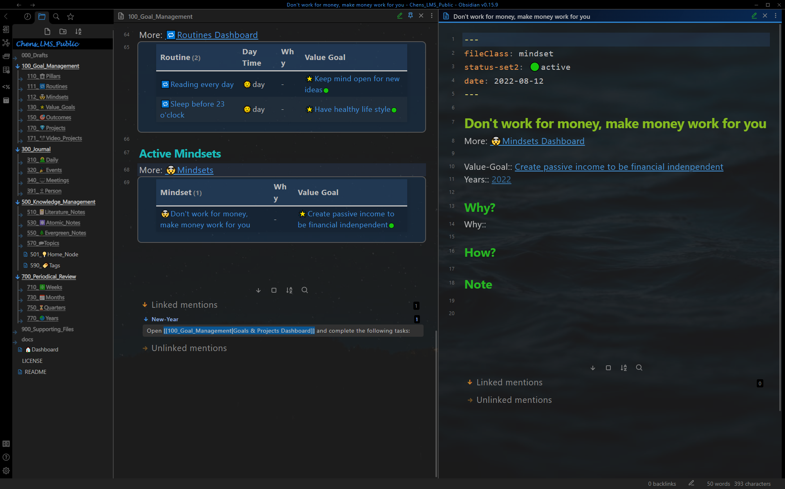

# Show Case - Goal management

## Pillar

Goal management dashboard (left pane, pinned) with a pillar note (right pane).  
**Dashboard**: All active pillars are shown here in a table.  
**Pillar note**: All value goals of the pillar are shown in a table.  

## Value Goal

Goal management dashboard (left pane, pinned) with a value goal note (right pane).  
**Dashboard**: All open value goals are shown here in a table.  
**Value goal note**: All outcomes of the value goal are shown in a table, also all routines and mindsets for the value goal.

## Outcome

Goal management dashboard (left pane, pinned) with an outcome note (right pane).  
**Dashboard**: All open outcomes are shown here in a table.  
**Outcome**: All projects of the outcome are shown in a table, with a progress bar for each project.  

## Project

Goal management dashboard (left pane, pinned) with a project note (right pane).  
**Dashboard**: All open projects are shown here in a table.  
**Project**: Actions are defined here. and done actions are automatically counted.   

## Routine

Goal management dashboard (left pane, pinned) with a routine note (right pane).  
**Dashboard**: All active routines are shown here in a table.  
**Routine**: Purpose, progress, and reflections of the routine are written here.  

## Mindset

Goal management dashboard (left pane, pinned) with a mindset note (right pane).  
**Dashboard**: All active mindsets are shown here in a table.  
**Mindset**: Purpose, progress, and reflections of the mindset are written here.  

## Dashboard for a single note type

For more detailed information, a separate dashboard is provided for each note type.  

### Value Goal Dashboard

3 value goals in total. all of them are open.

### Outcome Dashboard

4 outcomes in total. 3 of them are open, and 1 of them is closed.

