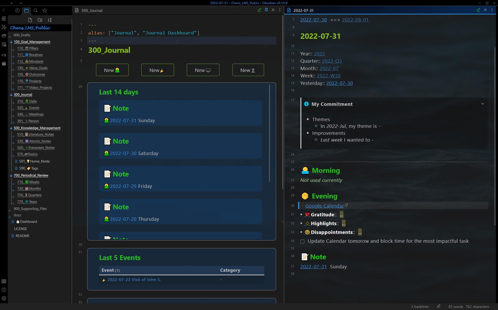
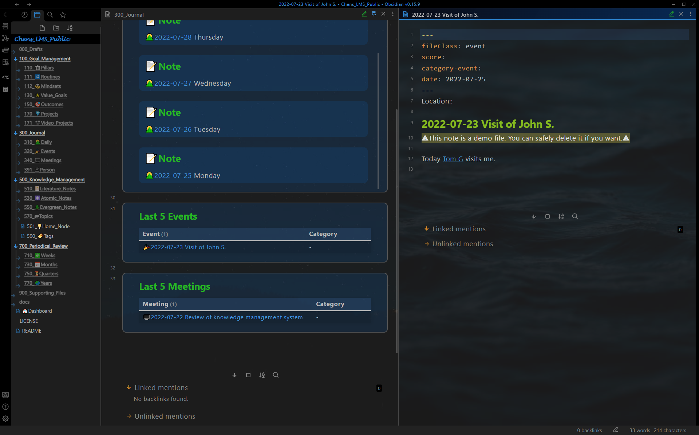
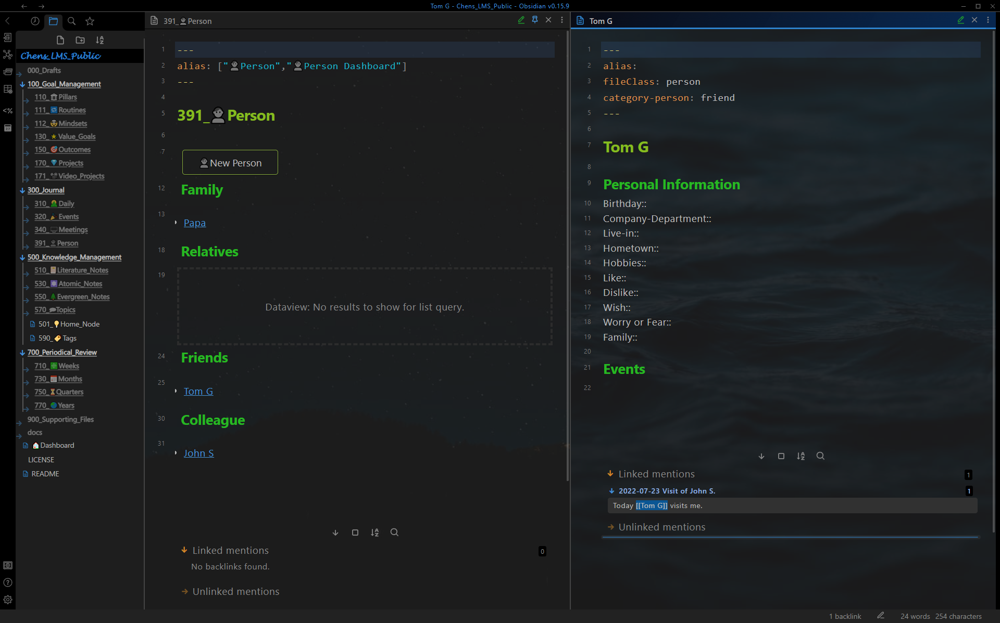

# Show Case - Journal

## Daily Note

Journal dashboard (left pane, pinned) with a daily note (right pane).  
**Dashboard**: Notes of the last 14 days are summarized here.  
**Daily note**:  Prompts for the focuses of the weeks and months, morning and evening routine, and other fleeting notes.  

## Event Note

Journal event (left pane, pinned) with an event note (right pane).  
**Dashboard**: the last 5 events are summarized here.  
**Event note**:  A note to record the private and working events.  

## Meeting Note

Journal dashboard (left pane, pinned) with a meeting note (right pane).  
**Dashboard**: the last 5 meetings are summarized here.  
**Meeting note**:  A note to record the meeting. 

## Person Note

Person dashboard (left pane) with a person note (right pane).  
**Dashboard**: All relevant people.  
**Person note**:  A note for a relevant person, related events and meetings are shown in the linked mentions.   

