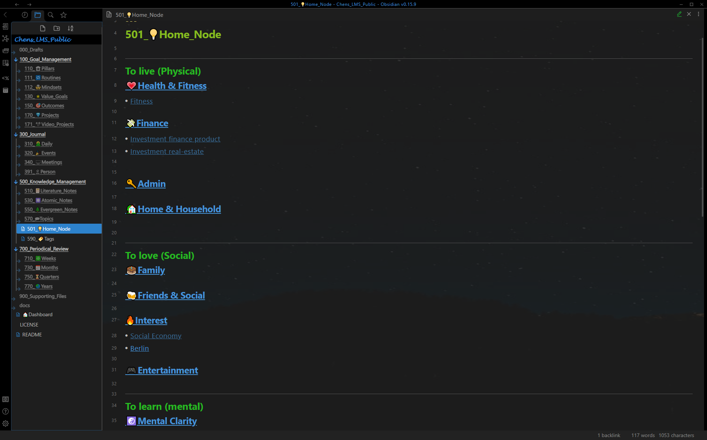

# Show Case - Knowledge Management  

## Knowledge Management Dashboard

Knowledge management dashboard with literature notes and evergreen notes for spaced repetition [^1] 

Knowledge management dashboard with final reviewed high-score notes

## Literature Note

Literature note dashboard (left panel) with a literature note (right panel).  
**Dashboard**: Notes are shown in different sections depending on reviews (captured, interim reviewed, final reviewed)  
**Literature note**: With yalm front matter, all related notes (context-aware resurfacing [^2]). body text processed with progressive summarization. 

## Atomic Note

Atomic note dashboard (left panel) with an atomic note (right panel).  
**Dashboard**: Notes are shown in different sections depending on the category  
**Atomic note**: With yalm front matter, and the notes mentioning it.

## Evergreen Note

Evergreen note dashboard (left panel) with an evergreen note (right panel).  
**Dashboard**: Notes are shown in different sections depending on reviews (captured, interim reviewed, final reviewed)    
**Evergreen note**: With yalm front matter, all related notes(context-aware resurfacing [^2]) and the notes mentioning it.

## Topic Note

Topic note dashboard (left panel) with a topic note (right panel).  
**Dashboard**: Notes are shown in different sections depending on scores and relations to value goals.  
**Topic note**: With yalm front matter, all not processed related notes (consolidation helper [^3]) and summary of the topic.

## Home Node

All top-level topics are connected to the home node, for easier navigation. 

## Tag

Tag dashboard

[^1]: **Spaced repetition:** The note will be shown automatically on the dashboards "510_📔Literature_Notes"/"550_🌲Evergreen_Notes" and "500_Knowledge_Management" after a certain period for the review, depending on the **score**, **reviewed** and **last-review** in the front matter.  

[^2]: **Context-aware resurfacing:** The note will be resurfaced automatically while editing literature notes, evergreen notes and topic notes with the same **tag**. 

[^3]: **Consolidation helper:** All notes with the **related tag** are shown below **Not Processed**. The notes will be no more list below **Not Processed**, as soon as they are referenced by the topic (using outlink).