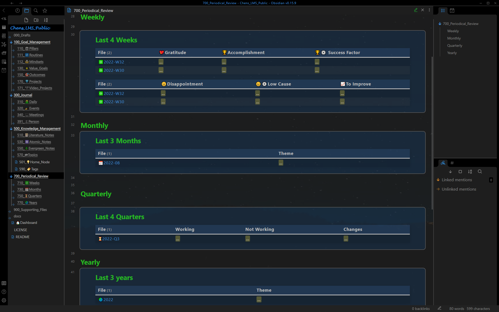
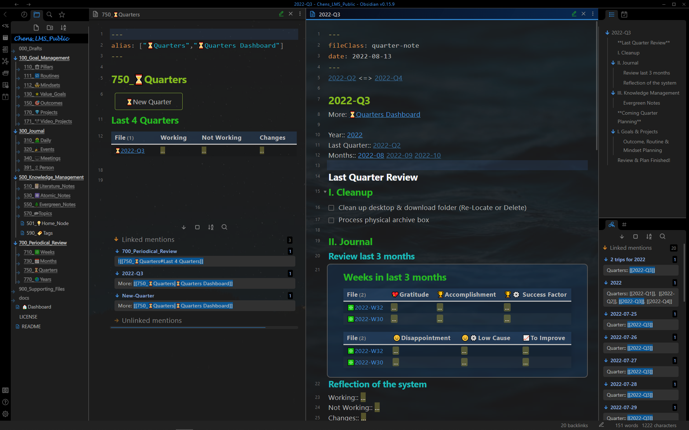

# Show Case - Periodic Review

## Periodic Review Dashboard

All Periodic Reviews on one page: weekly review, monthly review, quarterly review and yearly review.

## Weekly review

Weekly Review dashboard (left pane) with a weekly review note (right pane).  
**Dashboard**: Summary of the weekly reflection: gratitude, accomplishment, success factor...   
**Weekly Review**: Clean up, weekly reflection, a summary of the week... 

## Monthly review

Monthly Review dashboard (left pane) with a monthly review note (right pane).  
**Dashboard**: Summary of the monthly theme.   
**Monthly Review**: Spaced repetition of the knowledge notes, update routine and mindset... 

## Quarterly review 

Quarterly Review dashboard (left pane) with a quarterly review note (right pane).  
**Dashboard**: Summary of the quarterly theme.   
**Quarterly Review**: Clean up, Reflection of the system ...

## Yearly review

Yearly Review dashboard (left pane) with a yearly review note (right pane).  
**Dashboard**: Summary of the yearly theme.   
**Quarterly Review**: Past year review, coming year planning  

