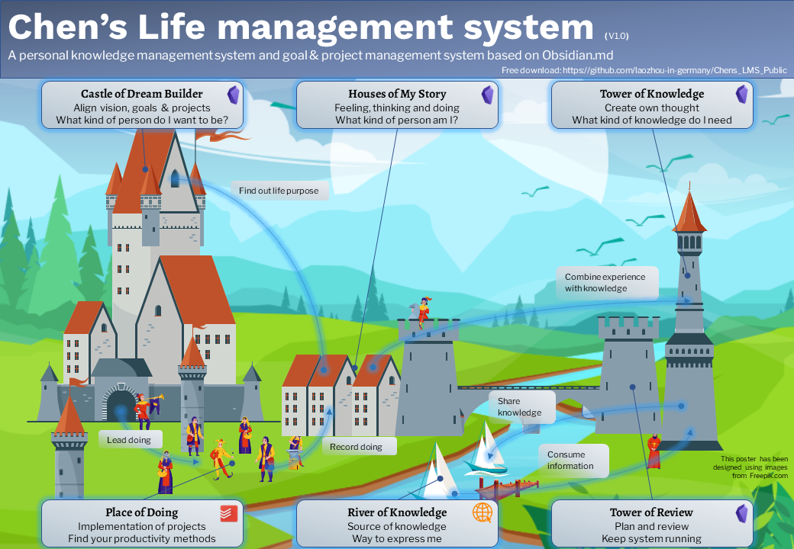

# LMS as a medieval town 

The LMS is a complex interactive system. It works like a town. The town has different districts. Each district fulfills a certain function. There is the business district, where people go shopping and make business. There is an industrial district, where products are produced and so on. But these districts alone don't create a living town. The goods and information are exchanged between them. One district relies on the services of other districts. 

If we consider the LMS as a medieval town. This town has 6 main districts:

- Dream Builder Castle
- Place of Doing
- Houses of My Stories
- Tower of Knowledge
- River of Knowledge
- Tower of Review

In the **dream builder castle** the vision, goals and projects are step by step broken down. The guiding question here is: what kind of person do I want to be? Finding the dream and choosing the right things are maybe the most important thing in life. 

On the **place of doing** the projects from the **dream builder castle** are to be implemented.  It's not easy to keep our commitment to ourselves. Sometimes we don't have sufficient time, Sometimes we don't have the willpower to do some boring tasks. Sometimes we just lost our priority due to a large number of tasks. Find the right productivity method for yourself and finish the tasks effectively. 

One of the most difficult things in life is maybe to know yourself. Writing a journal helps you to know yourself. In the **houses of my stories** the feeling, thinking and doing are recorded. The guiding question here is: What kind of person am I? The improved self-awareness helps you to find your life purpose. And combing own experience with theoretical knowledge creates wisdom. 

The **river of knowledge** is the way to communicate with the outside world.  We consume information from the outside world. Creating a good habit to consume information in this world of information overload is a key competence. We are not only consumers using the river of knowledge, but also participants in the river of knowledge. We use it to exchange our experiences and opinions with others and also share our knowledge.

The **tower of knowledge** is a place, where we consume the external information effectively and also create our thought. Here don't forget to ask about the purpose of consuming the information: What kind of knowledge (information) do I need, to ...? For me, the question is: What kind of knowledge do I need to complete my projects and reach my goals?

It's quite complicated to make each part work correctly and keep them interactive with each other smoothly, isn't it? It's important, that we from time to time step back and review each part and the complete system. In the **tower of review**, we review them periodically, clean out each part and keep the system running. 

For a poster with more detailed information about each district see [LMS_poster_portrait](images/LMS_poster_portrait.png)