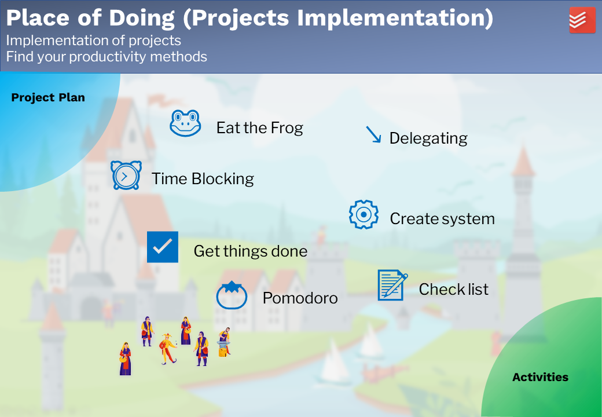

# Projects Implementation

After the project plan is done, the next step is the project implementation. There are a lot of productivity methods. They may support us to complete the tasks in the project effectively. If a productivity method works for someone, depends on a lot of factors: the personal character, the tasks, and the implementation of the method. Everyone should find the productivity methods, which work for him. Here are the methods, which work for me:

1. Eat the frog
2. Time blocking
3. Get things done
4. Pomodoro
5. Delegating
6. Create a system
7. Checklist

The project implementation is although part of the life management system. It is not implemented in Obsidian. Other special tools may support it better, e.g. Todoist. The usage of the tools and methods are not described here. 