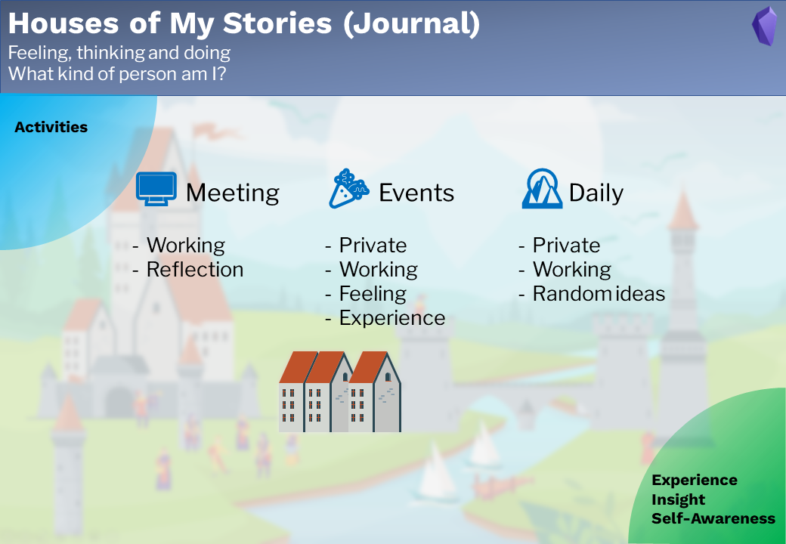

# Journal

## Note types

3 note types are used for the journal:

- 🌄Daily note
- 🎉Event note
- 🖥Meeting note

**The daily note** is mainly for daily records and routine, like Gratitude, Highlights and Disappointments.
**The event note** is used for important events. for both private and working events. e.g. Parties, trips and conference. 
**The meeting node** is used for meetings. 

## Workflow
Journaling is one of the ways to know ourselves. Make journaling to record our daily activities, review them, and reflect on them. This is going to increase self-awareness, and support us to find our dream and life goals. 