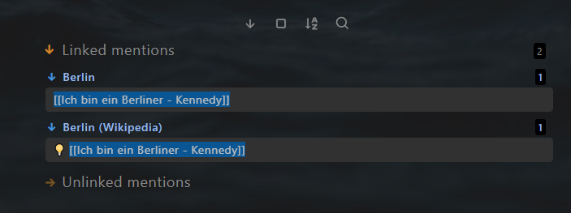

# Atomic note

## Note file structure

Anthe  Atomic note consists of 4 parts:

- Yalm front matter
- "Context-aware resurfacing"  section 
- Note title
- Body text

### Yalm front matter 

The atomic note has the following standard property in the yalm front matter. 

~~~yaml
---
author: Kennedy 
excerpt: a speech by United States President John F. Kennedy 
fileClass: atomic-note  
score: xx 
category-atomic-note: aphorism  
reviewed: x 
date: 2022-07-14  
last-review: 2022-07-14  
---
~~~

`author`: Author of the literature, optional  

`excerpt`: Excerpt of the note, optional

`fileClass`: Note type, always `atomic-note` 

`score`: The score of the note, possible value: x,...,xxxxx, required for the feature **Spaced repetition**

`category-atomic-note`: Category of the atomic note, optional

`reviewed`: Review times, possible value: x,...,xxxxx, required for the feature **Spaced repetition**

`date`: Creation date of the note, automatically created 

`last-review`: Date of the last review, required for the feature **Spaced repetition**


### "Context-aware resurfacing"  section 

After the yalm front matter, there is a section for "Context-aware resurfacing". 

```javascript
Tags:: #berlin

```

It has one part.

Part 1: `Tags::`, for defining the context with tag 

You can also tag in other note lines.  This line is only a suggestion to keep notes having a similar structure

In the atomic note, resurfacing other notes is not intended. So there is no similar dataview code block like the literature note. 

### Note title

The note title and the note file name are kept in sync with the plugin [Filename heading sync](https://github.com/dvcrn/obsidian-filename-heading-sync).

### Body text

Example:

```markdown
"Ich bin ein Berliner" ("I am a Berliner") is a speech by United States President John F. Kennedy given on June 26, 1963, in West Berlin. - [Ich bin ein Berliner - Wikipedia](https://en.wikipedia.org/wiki/Ich_bin_ein_Berliner)

```


## Backlinks

The atomic notes are expected to be quoted by the other notes. You can find all notes, which quote the current atomic note in the section linked mentions. 




