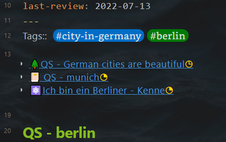

# Linking the notes with links and tags

This vault is designed to use tags to link notes with similar content.

## Add tag
In the literature note, atomic note, and evergreen note the tags are directly written after the yalm frontmatter.  
See example below

~~~
---
author:  
excerpt:  
fileClass: literature-note  
score: xxx 
category-literature-note: article  
reviewed: x  
cover:  
date: 2022-07-13  
last-review: 2022-07-13  
---
Tags::  #city-in-germany #berlin
~~~

## Show notes with the same tags.
The literature notes and evergreen notes have a dataview code segment to show the notes with the same tags, in case you add them using a template. it's between the tags and the title.

You can also add this dataview code segment by using templater: 

1. Pressing **alt + t**
2. Select **Insert-Notes-Share-Tags**

