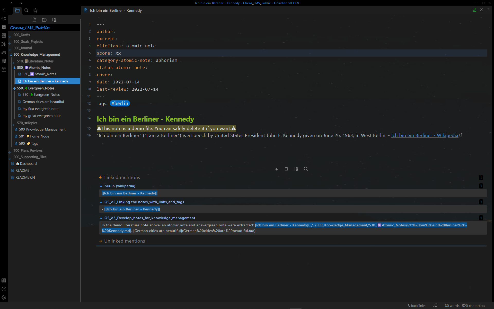
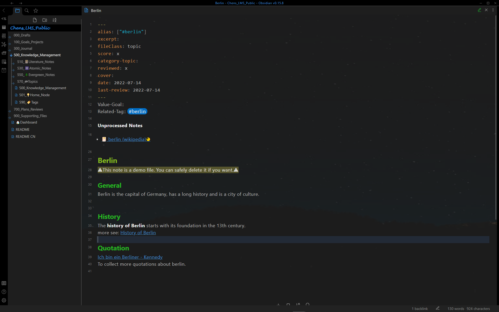

# Show Case - Knowledge Management  

## Knowledge management dashboard

Knowledge management dashboard with literature notes and evergreen notes for **spaced repetition** [^1] 

Knowledge management dashboard with final reviewed high-score notes 

## Other dashboards

Literature note dashboard with **spaced repetition** [^1] 

Atomic note dashboard

Evergreen note dashboard with **spaced repetition** [^1] 

Topic note dashboard

Tag dashboard

## Single note pages

Literature note with context-aware resurfacing, including extracted atomic note and evergreen note, bolded, highlighted and summarized

Atomic note

Evergreen note with **context-aware resurfacing** [^2]

Topic note with consolidation helper [^3]

[^1]: **Spaced repetition:** The note will be shown automatically on the dashboards "510_📔Literature_Notes"/"550_🌲Evergreen_Notes" and "500_Knowledge_Management" after a certain period for the review, depending on the **score**, **reviewed** and **last-review** in the frontmatter.  

[^2]: **Context-aware resurfacing:** The note will be resurfaced automatically while editing literature notes, evergreen notes and topic notes with the same **tag**. 

[^3]: **Consolidation helper:** All notes with the **related tag** are shown below **unprocessed**. The notes will be no more list below unprocessed, as soon as they are referenced by the topic (using outlink).