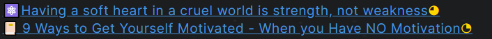

# Note types

I distinguish all the notes in the PKM into 4 types:

- 📔Literature Note
- ⚛️Atomic Note
- 🌲Evergreen Note
- 🗩Topic

**The literature note** includes all notes from the external. E.g., Books, articles, tweets, and videos. It is normally a mixture of information pieces. E.g., facts, opinions, stories, and so on. These information pieces together create a medium, which I custom. 

**The atomic note** is the note from the external but only includes a single knowledge point. E.g., a story, an aphorism. They are the extracted highlights from the literature note and can be cited later in my articles. 

**The evergreen note** is the note for my insight. its maturity level grows with my new knowledge and experience. It is a single information piece within one topic. 

**The topic** is a collection of literature notes, atomic notes, and evergreen notes, which handle the same issue. The maturity level of the topics grows as the number of his child notes increases. 

#### Why note type and these 4 note types?

Distinguishing between different note types means effort. On the side, I must somehow mark it in the notes. It means typing more information in the note. By a large amount of note, it’s annoying to such kind of repetitive job. On the other side, I must decide, which kind of note type I should use. Sometimes it’s quite straightforward. But there are also situations, in which it’s difficult to decide the note type. 

So, the question is, is it worth defining note types. My answer is clear: **YES**. First, it’s quite common, that the popular PKMs use different note types. Second, the purpose of my PKM is a tool for critical thinking and the balance between costuming and creating information.  To support this purpose, it’s necessary to use different note types. 

##### Zettelkasten 

The Zettelkasten is a notetaking system, invented by the German philosopher Niklas Luhmann. Luhmann wrote more than 70 books and 400 scholarly articles in his life. His extremely high productivity is supported by his Zettelkasten. In the Zettelkasten he used 3 different note types. 

- Fleeting notes: temporary notes made throughout the day while thinking and reading

- Literature notes: from research project and book project with an external reference 

- Permanent notes:  important insight and ideas, which derive from fleeting notes and literature notes. 

##### [Linking Your Thinking](https://www.linkingyourthinking.com/)

Linking Your Thinking (LYT) is a PKM by Nick Milo. His work process is also a process of 5 levels of idea emergence.

Level 1: Ideas as atomic notes

Level 2: Growing note library and Linking Atomic notes

Level 3: Assemble, collide and unify to MOC

Level 4: Create a web of MOC and creation

Level 5: Link to the Home node and create Home maps

Here he uses two types of notes:

- Atomic note: single ideas 

- MOC: map of content, which links the single ideas

And his idea of merging ideas bottom-up is a different approach from what I usually use. When I start researching about one topic, I usually use the top-down approach. I’m not thinking one approach is better than another approach. It depends on the use cases. If you want to research a topic, I still think the top-down approach is more efficient. But if you want to consolidate the existing knowledge, the button-up approach is the better one. 

##### [Note system](https://notes.andymatuschak.org/Evergreen_notes) from Andy Matuschak

Matuschak is referenced a lot by his definition of the evergreen note. He said,

> Evergreen notes are written and organized to evolve, contribute, and accumulate over time, across projects.
>
> - Evergreen notes should be atomic
> - Evergreen notes should be concept-oriented
> - Evergreen notes should be densely linked
> - Prefer associative ontologies to hierarchical taxonomies
> - Write notes for yourself by default, disregarding the audience

The idea of the evergreen note is an eye-opener for me when I read it for the first time.  The idea to evolve the note over time, across projects solves one of the problems when I take notes in the past: The written notes are normally never touched again later. So I ask myself, Why do I take notes, since they are never been read or used again. The idea of the evergreen note solves the problem.

#### What kind of note type do I(you) need?

Although a lot of notetaking system uses different note type, the definition differs. 

What kind of note types do I need? This is not an easy question to answer. I think it depends on **the purpose of PKM**. 

For me, the PKM is a tool to support me in generating my ideas, based on the consumed information(books, articles...). So I want to distinguish between external information and my ideas. The process is to consume the external information, break them into small pieces down, generate my ideas, and consolidate small pieces of information into knowledge. 

My purpose of the PKM has two dimensions: external vs internal, a single piece of information vs combined information. These two dimensions define a matrix in the following table. This is the basis for the definition of my note types.

|              | Combined        | Single piece |
| ------------ | --------------- | ------------ |
| **External** | Literature note | Atomic note  |
| **Internal** | Topic           | Evergreen    |

The workflow is

1. Distill the literature note
2. Extract the atomic note 
3. Generate the evergreen note
4. Consolidate the topic 

#### How to implement note type in Obsidian?

There are different ways to define note types. 

1. Use a naming conversion, E.g. the literature note starts always with "l-"
2. Use tags. E.g. `#literate-note`
3. Use yalm frontmatter, E.g. `note-type: literature-note`. 

I use the 3. solution.  The following section shows the example of the yalm frontmatter. Templates are defined to quickly add different types of notes, supported by the plugin [Templater](https://github.com/SilentVoid13/Templater).  The property name is `fileClass`. It is for better compatibility with the plugin [Supercharged links](https://github.com/mdelobelle/obsidian_supercharged_links). 

~~~
---
author:  
excerpt:  
fileClass: literature-note  
score: xx 
category-literature-note: video  
reviewed: x  
cover:  
date: 2022-05-27  
last-review: 2022-05-27  
---
~~~

And I use [Supercharged links](https://github.com/mdelobelle/obsidian_supercharged_links) to display an emoji before the title of the notes automatically.  



#### How to use the note type information?

As soon as each note has a standard yalm frontmatter, the vault converts to a database. With the plugin [Dataview,](https://github.com/blacksmithgu/obsidian-dataview) the information in the database can be displayed.  In my vault, Dataview is heavily used to support different kinds of automation. 

For example, the following code displays all of the literature notes, which are scored as "xxxxx". 

~~~
```dataview
list 
where fileClass = "literature-note" and score="xxxxx"
```
~~~

