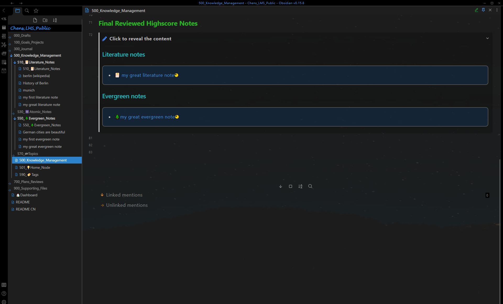
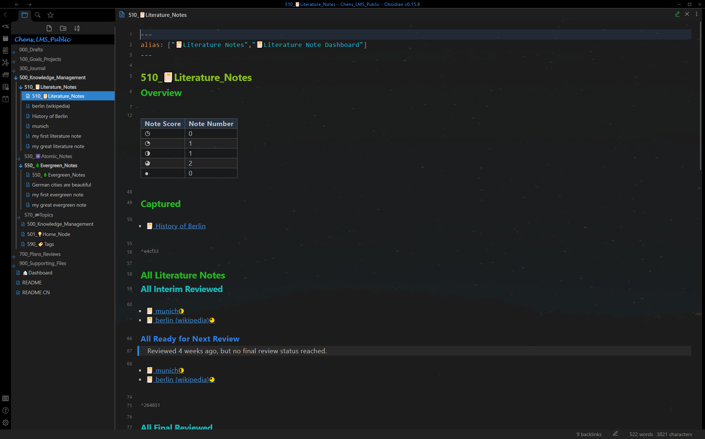
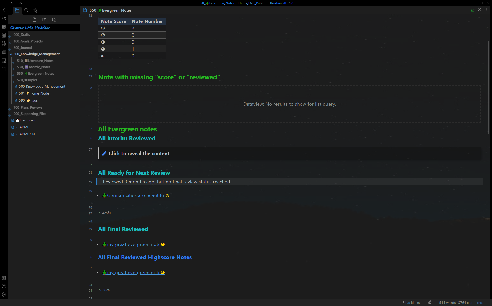
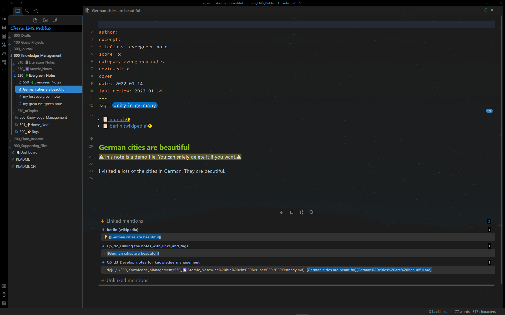
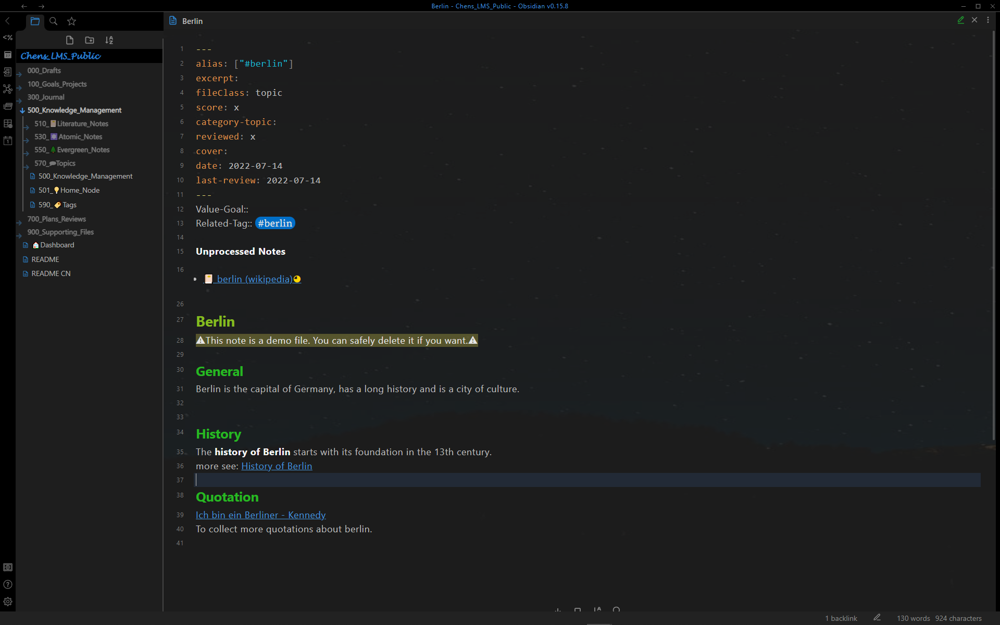

# 展示 - 知识管理

## 知识管理Dashboard

知识管理Dashboard: 使用**间隔重复**自动显示的文献笔记和常青笔记 [^1]

知识管理Dashboard: 最终回顾后的高分笔记

## 其他Dashboard

文献笔记Dashboard: 使用**间隔重复**自动显示的文献笔记 [^1]

原子笔记Dashboard

常青笔记Dashboard: 使用**间隔重复**自动显示的常青笔记 [^1]

主题笔记Dashboard

标记Dashboard

## 单笔记页面

文献笔记： 相关笔记自动重现 + 提取的原子笔记和常青笔记 + 粗体，高亮显示和总结

原子笔记

常青笔记: 相关笔记自动重现 [^2]

主题笔记: 整合助手 [^3]

[^1]: **间隔重复:** 该笔记将在一定日期后自动显示在Dashboard上(“510_📔Literature_Notes”, “550_🌲Evergreen_Notes”, “500_Knowledge_Management”)。 这项功能取决于在front matter 中的**score**, **reviewed**和**last-review**。

[^2]: **根据内容自动显示笔记：**在编辑具有相同**标签**的**文献笔记**、**常青笔记**或**主题笔记**时，该笔记将自动重现。

[^3]: **合并助手:** 所有带有相关**标签** 的笔记都列在 **unprocessed** 下面。一旦在**主题笔记**中引用它们（使用外链接），笔记就不再显示在**unprocessed**。