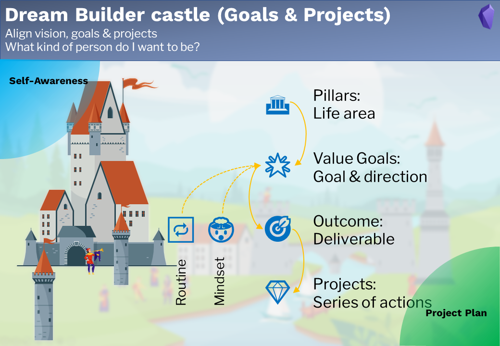

# Goals & Projects

## Note types

6 note types are used for goals & projects:

- 🏛Pillar 
- 🌟Value goal
- 🎯Outcome
- 💎Project
- 🔁Routine
- 🤯Mindset

**The pillars** are the important life areas. e.g. finance, health, family. 

**The value goals** are the desired direction in each pillar, they are normally not concrete, not quantified, but a clear statement about our dreams. e.g. "I want to have a healthy lifestyle" or "I'd want to be a good husband."

**Outcomes** are the concrete deliverable for achieving the value goals. They must be quantified, terminable and actionable. e.g. " Go swimming 10 times this year" or "Celebrate wedding anniversary every year". Make sure, that the defined outcomes really serve the value goals and also sufficiently. 

## Workflow

### Pillars

- Create literature notes by recording outside world information 

- Distill literature notes

### Value Goal

- Extract atomic notes from the literature note

- Link atomic notes to evergreen notes

### Outcome

- Generate evergreen notes from the literature note, own experience and insight 

- Garden evergreen notes

### Project

- Create topic notes

- Consolidate topics from literature notes, atomic notes, evergreen notes and sub-topic notes. 
- Connect topic notes to the home node

### Routine

### Mindset

