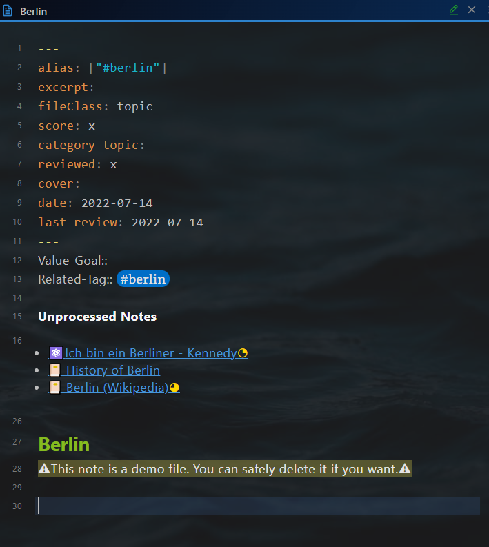
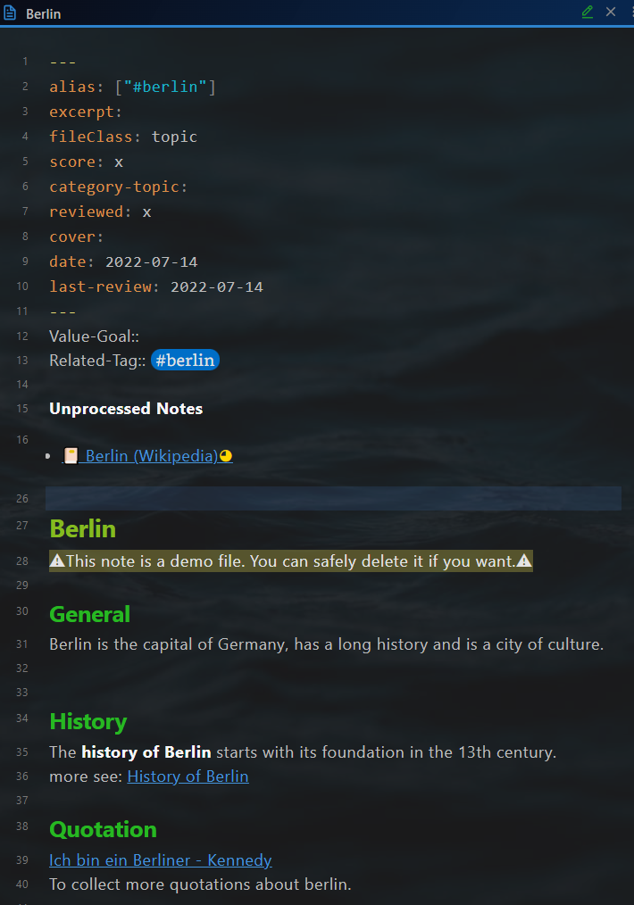

# Topic 


## Note file structure

A topic note consists of 4 parts:

- Yalm front matter
- "Consolidation helper"  section 
- Note title
- Body text

### Yalm front matter 

The topic note has the following standard property in the yalm front matter. 

~~~yaml
---
alias: ["#berlin"]
excerpt:  
fileClass: topic  
score: x  
category-topic:   
reviewed: x  
cover: 
date: 2022-07-14  
last-review: 2022-07-14  
---
~~~

`alias`: Alias of the note, optional

`excerpt`: Excerpt of the note, optional

`fileClass`: Note type, always `topic` 

`score`: The score of the note, possible value: x,...,xxxxx, required for the feature **Spaced repetition**

`category-topic`: Category of the topic note, optional

`reviewed`: Review times, possible value: x,...,xxxxx, required for the feature **Spaced repetition**

`date`: Creation date of the note, automatically created 

`last-review`: Date of the last review, required for the feature **Spaced repetition**


### "Consolidation helper"  section 

After the yalm front matter, there is a section for "Consolidation helper". 

```javascript
Value-Goal::  
Related-Tag:: #berlin 

**Unprocessed Notes**
~~~dataviewjs
let currentPage = this.current()
let tagRel = currentPage["Related-Tag"]
let notes = dv.pages(tagRel 
			+ ' and !"' + this.current().file.path + '"' )
			.where(p => !p.file.inlinks.includes(currentPage.file.link) & p.file.etags.includes(tagRel));
if (tagRel != "#dummytopic") {
	dv.list(notes.file.link);
}
~~~
```

It has three parts.

Part 1: `Value-Goal::`, For which value serves this topic, purpose of studying this topic

Part 2: `Tags::`, for defining the context to be consolidated in this topic

Part 3: dataview code block to support the consolidation.

All notes with the **related tag** are listed below **Unprocessed**. The notes will disappear, as soon as they are referenced within the topic (using a wiki link).

Before consolidation: Three notes are unprocessed.


After consolidation: One note remains unprocessed.



### Note title

The note title and the note file name are kept in sync with the plugin [Filename heading sync](https://github.com/dvcrn/obsidian-filename-heading-sync).

### Body text

Use the wiki link to reference the related notes.
